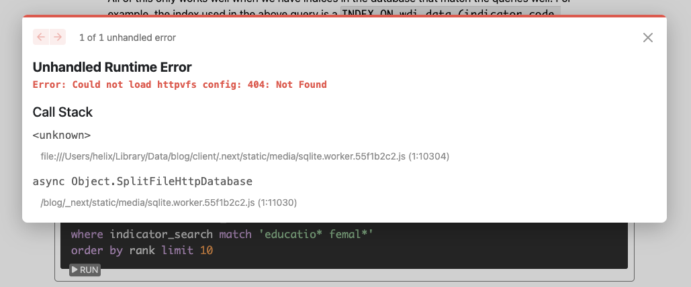

[Timelines ML](../) 

The timeline chart is [React Recharts D3](https://recharts.org/en-US/storybook)
Defined in phiresky's [FtsDemo.tsx TypeScript](https://github.com/phiresky/blog/blob/master/client/sqlite-httpvfs/FtsDemo.tsx)

The following aims to run [Phiresky's excellent SQLite timeline sample](https://phiresky.github.io/blog/2021/hosting-sqlite-databases-on-github-pages/) locally and then on GitHub Pages.

# SQLite in Browser

Try [Steps for deploying a React App to Github Pages](https://gist.github.com/vre2h/da9db3733c238c174d13670fb77c1f1a)

Fork [our fork](https://github.com/ModelEarth/blog) of Phiresky's blog sample, then clone to your local computer.

Please add to the steps below on installing the SQLite blog. [Fork to edit current page](https://github.com/ModelEarth/data-pipeline/tree/main/timelines/sqlite).

You could use this [Pandoc GitHub Action](https://github.com/pandoc/pandoc-action-example) to convert documents on GitHub's servers with every push, to avoid building locally.

Once the Github Page deployment works, our fork will be visible at [model.earth/blog/2021/hosting-sqlite-databases-on-github-pages](https://model.earth/blog/2021/hosting-sqlite-databases-on-github-pages/)

## SQLite blog sample install

We recommend upgrading your OS before starting if your current version is more than 2 months old.

(1) Update to the latest version of Next and React.
And download the React DevTools for a better development experience:
[https://reactjs.org/link/react-devtools](https://reactjs.org/link/react-devtools)

Clone the blog into your webroot

	git clone https://github.com/phiresky/blog blog &&
	cd blog

<!--
	git clone https://github.com/modelearth/blog blog

This was probably un-done:
In our fork, Nextjs is migrated to the new version which uses RUST.
-->

Start a virtual environment in the local folder.

	python3 -m venv env &&
	source env/bin/activate

Add env/ the .gitignore file.

<!--
IMPORTANT: Try using "npm ci" here rather than "npm install"
"npm ci" avoids changing the package-lock.json file, which creates conflicts.
(Haven't confirmed yet if package-lock.json was getting changed.)
-->

	npm install

Error: Cannot read properties of undefined .pnp.cjs
This relates to nextJS.

Could not resolve dependency:
npm ERR! peer react@"^15.3.2 || ^16.0.0" from react-katex@2.0.2
npm ERR! node_modules/react-katex
npm ERR!   react-katex@"^2.0.2" from the root project

<!--
Tried this, did not fix:

	yarn add react-katex

	npm list
	npm install

Install React and React Devtools (Skipped this March 7, but let's try upgrading in our fork)

	npm install next@latest react@latest react-dom@latest &&
	npm install -g react-devtools
-->
---

next-blog@workspace:.: This package doesn't seem to be present in your lockfile; run "yarn install" to update the lockfile

	yarn install

Run these commands in the blog folder (These are from the [blog folder readme](https://github.com/phiresky/blog/)):

	yarn posts &&
	yarn dev

"yarn dev" provides the hot-reloading dev server. View the blog page at:  
[localhost:3000/blog/2021/hosting-sqlite-databases-on-github-pages](http://localhost:3000/blog/2021/hosting-sqlite-databases-on-github-pages/)

You can view a list of all the blog posts at [localhost:3000/blog/](http://localhost:3000/blog/)

Error to resolve - not finding SQLite data.

Once we fix the error above, the next step is to deploy to GitHub Pages. 

## Deploy to GitHub Pages

Once the steps are completed, we'll have a page like [Phiresky's SQLite blog](https://phiresky.github.io/blog/2021/hosting-sqlite-databases-on-github-pages/) 

In a new command window:

	yarn build  &&
	yarn commit

If you get an error with the "yarn dev" command, to resolve "SWC Failed to Load", include "--force" based on: https://nextjs.org/docs/messages/failed-loading-swc and run these 3 commands

	npm install --force
	npm audit fix --force
	yarn install

Hit return during "yarn install". (Entering an * didn't work.)

<!-- This is fixed now
5. Two errors  currently need to be resolved:

A. postprocess.sh Transformation error (Missing semicolon.
B. Transformation error (Topic reference is used, but the pipelineOperator plugin was not passed a "proposal": "hack" or "smart" option.
-->

### Additional notes

Let Loren know if you used any of the following and we can move into steps above:

Ran to update pandoc. You may need to upgrade your OS and brew.

Install latest pandoc
https://github.com/jgm/pandoc/releases/latestpandoc --version

The following command may reveal that pandoc resides in the Anaconda folder.

	which pandoc

That seems to be okay. Ran (but no change to pandoc version in the Anaconda folder.)

conda update -n base anacondaYou may need to include --force when running this:git -C /usr/local/Homebrew/Library/Taps/homebrew/homebrew-core fetch --unshallow

brew update
brew upgrade
brew install pandoc

### Fixes applied in our Fork of the "blog" repo

Fixed nextjs link error.  Invalid <Link> with <a> child. Please remove <a> or use <Link legacyBehavior>

	npx @next/codemod new-link --force

You might need to add [Pandoc GitHub Action](https://github.com/pandoc/pandoc-action-example) in your fork of [our fork](https://github.com/ModelEarth/blog) to convert documents on GitHub's servers with every push (or maybe just building locally is fine).
